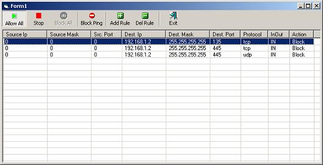



## xp firewall

### Description

XP firewall based on iphlpapi.dll. I haven't tested it in other OS's apart from XP.
 
### More Info
 

             |
---                |---
**Submitted On**   |2011-10-10 13:30:24
**By**             |[mbote](https://github.com/Planet-Source-Code/PSCIndex/blob/master/ByAuthor/mbote.md)
**Level**          |Intermediate
**User Rating**    |4.0 (8 globes from 2 users)
**Compatibility**  |VB 6\.0
**Category**       |[Internet/ HTML](https://github.com/Planet-Source-Code/PSCIndex/blob/master/ByCategory/internet-html__1-34.md)
**World**          |[Visual Basic](https://github.com/Planet-Source-Code/PSCIndex/blob/master/ByWorld/visual-basic.md)
**Archive File**   |[xp\_firewal22127210102011\.zip](https://github.com/Planet-Source-Code/mbote-xp-firewall__1-74128/archive/master.zip)

